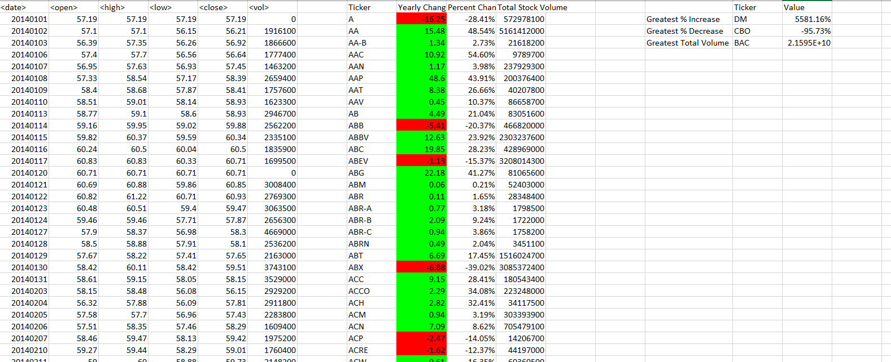

# VBA-Challenge

## Challenge Details

This challenge was to create a VBA script that would take an excel file containing stock information for multiple stocks from the years 2014 to 2016 and output each stock's:

* yearly change from opening price at the beginning of a given year to the closing price at the end of that year
* percent change from opening price at the beginning of a given year to the closing price at the end of that year
* total stock volume of the stock

Next, conditional formatting was used to highlight yearly change in red if negative and green if positive (see image below).

As an additional challenge, the VBA script was modified to also return the stock with the "Greatest % increase", "Greatest % decrease" and "Greatest total volume". 

The VBA script is set to run on every worksheet (each year) by running it one time. 

See example output below for the year of 2014:

 

## Included Files

In this repository, the following files are included:
* Main BAS file - the VBA script needed to run through each excel worksheet and perform necessary calculations
* Snapshot of output for each year (2014, 2015, 2016)
* Due to the file size (~93MB), the Multiple Year Stock Data file that the BAS script was created for could not be uploaded, but a snapshot of the original file can be seen below: 

 
